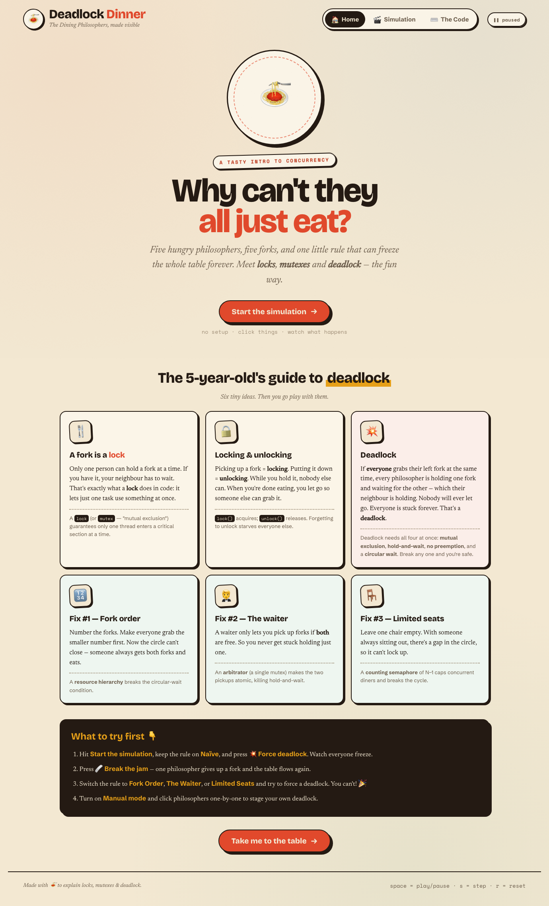
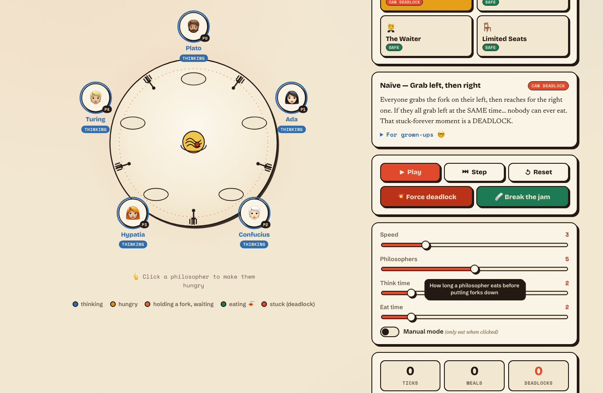
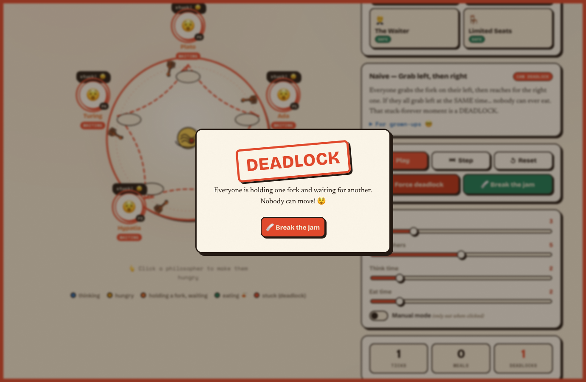

# 🍝 Deadlock Dinner

**An interactive, kid-friendly visualization of the Dining Philosophers problem** — watch *locks*, *mutexes*, *semaphores* and *deadlock* come alive at a candle-lit table, then read the real **Java** and **Go** code that makes it happen.

> Five hungry philosophers. Five forks. Each one needs **two** forks to eat spaghetti. What could possibly go wrong? 😅

🔗 **Live demo:** https://deadlock-dinner.pulsar-projects.org





---

## What is this?

The [Dining Philosophers problem](https://en.wikipedia.org/wiki/Dining_philosophers_problem) is the classic way computer scientists teach **concurrency**: how multiple things sharing limited resources can step on each other's toes — and freeze forever in a **deadlock**.

This site makes it tangible. A 5-year-old can click a philosopher to make them hungry, watch forks glow as they're grabbed, and *see* the exact moment everybody gets stuck. Then they (or a curious grown-up) can flip to the **Code** tab and read working implementations.

## Features

- 🎬 **Live simulation** — philosophers think, get hungry, grab forks, and eat in real time. Forks physically slide into hands and glow with the holder's color.
- 👆 **Click to interact** — click any philosopher to make them hungry on demand. Turn on **Manual mode** to stage a deadlock by hand.
- 💥 **Force a deadlock** — one button recreates the textbook circular wait. A red **DEADLOCK** banner and animated arrows show exactly who's waiting on whom.
- 🩹 **Break the jam** — resolve a deadlock and watch the table flow again.
- 🧩 **Four strategies**, switchable live:
  | Rule | What it does | Safe? |
  |---|---|---|
  | **Naïve** | Grab left fork, then right | ❌ can deadlock |
  | **Fork Order** | Always grab the lower-numbered fork first (resource hierarchy) | ✅ |
  | **The Waiter** | A central mutex grants both forks atomically (arbitrator) | ✅ |
  | **Limited Seats** | At most N−1 may try at once (counting semaphore) | ✅ |
- 🎛️ **Tweakable variables** — number of philosophers (3–7), think time, eat time, and speed.
- ⌨️ **Real code** — syntax-highlighted **Java** and **Go** for every strategy, with a copy button.
- 💡 **Learn tab** — plain-language explanations of locks, mutexes, semaphores and the four conditions of deadlock.
- 📱 Fully responsive, keyboard shortcuts (`space` play/pause, `s` step, `r` reset), and `prefers-reduced-motion` support.



## Tech

Pure, dependency-free **static site** — vanilla HTML, CSS, and ES modules. No build step, no framework.

```
public/index.html          markup — Home, Simulation & Code tabs
public/css/styles.css      the "Trattoria Press" theme (risograph/editorial print)
public/js/sim.js           the concurrency engine (strategies + deadlock detection)
public/js/render.js        hybrid SVG + HTML renderer
public/js/app.js           controls, narrator, log, stats, guided tour, code viewer
public/js/code-samples.js  the Java & Go reference programs
worker/index.js            tiny Worker: serves the assets + forces HTTPS
wrangler.jsonc             Cloudflare Worker config (static assets + custom domain)
```

The landing page is a **Home** tab that teaches the concepts, then sends you into the **Simulation**, which greets first-time visitors with a guided tour and hover tooltips on every control.

Syntax highlighting uses [highlight.js](https://highlightjs.org/) from a CDN (with a graceful plain-text fallback). Fonts: [Bricolage Grotesque](https://fonts.google.com/specimen/Bricolage+Grotesque) (display), [Newsreader](https://fonts.google.com/specimen/Newsreader) (prose), [Schibsted Grotesk](https://fonts.google.com/specimen/Schibsted+Grotesk) (UI), [Space Mono](https://fonts.google.com/specimen/Space+Mono) (code).

## Run locally

It's static, so any web server works (you do need a server, not `file://`, because it uses ES modules):

```bash
cd public && python3 -m http.server 8799
# open http://localhost:8799
```

## Deploy

Deployed as a **Cloudflare Worker** serving the `public/` directory as static assets (with a tiny `worker/index.js` that forces HTTPS). The `custom_domain` route in `wrangler.jsonc` makes Wrangler auto-provision the DNS record + SSL cert on deploy:

```bash
wrangler deploy
```

## The reference code

Both languages compile cleanly (`javac`, `go build`/`go vet`) and the `naive` versions genuinely *can* deadlock — that's the point. See the **Code** tab in the app or [`public/js/code-samples.js`](public/js/code-samples.js).

## License

[MIT](LICENSE) — have fun with it.

---

<sub>Made with 🍝 to explain locks, mutexes & deadlock.</sub>
